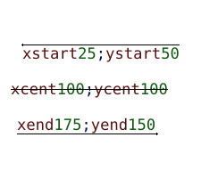
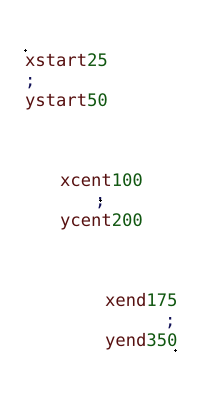

# A basic extension of the image/imageproc crates for writing multiline colored text

I initially wrote this code for this project: [hibou](https://github.com/erwanM974/hibou_label).

Since then it has evolved a bit and I decided to repackage it on its own as a library.

## Single line colored text

In the example below some colored text is written on a single line at different positions.
In each of the three example, the little cross corresponds to the anchor position on which the text is written,
with different options on how to use this position:
- in the first example the text is written below and on the right of the anchor
- in the second the text is centered around the anchor
- in the third example, it is written above and on the left

The horizontal lines correspond to the expected width of the text.

## Multiline colored text

In the example below we have a similar example except that the input text is formatted in several lines.
We also provide a means to specify the text alignment which is:
- on the left for the first example
- centered for the second
- on the right for the third

